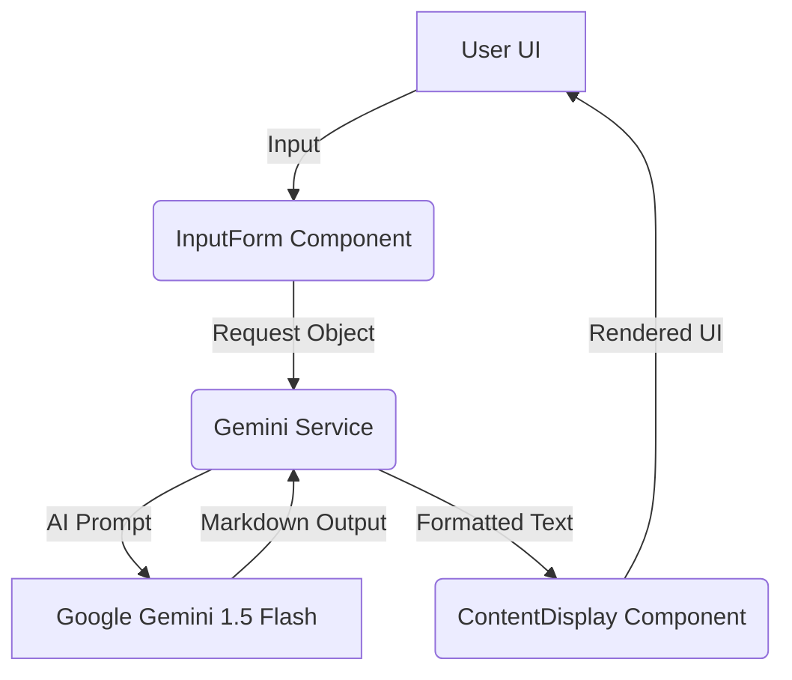

# Design Document: Dr.Content

## 1. Architectural Overview
Dr.Content follows a modern, client-heavy architecture designed for speed and responsiveness. It utilizes a modular React structure with a clear separation between UI components and service layers.

### Flow Diagram

## 2. Component Design
- **InputForm**: A stateful component that manages user selections for topic, platform, tone, and audience. It utilizes debounced inputs and visual feedback for better UX.
- **ContentDisplay**: A markdown-rendering component that parses AI output into a readable "Strategy Blueprint" with copy-to-clipboard functionality.
- **Service Layer**: `geminiService.ts` encapsulates the SDK logic, handling API key validation and providing a robust fallback (Mock Mode) for development and demonstration purposes.

## 3. UI/UX Philosophy
The design language is "Neo-Glassmorphism," aimed at creating a premium, modern feel:
- **Visual Depth**: Use of backdrop filters, subtle borders, and layered shadows to create hierarchy.
- **Ambient Accents**: Dynamic background blobs that move subtly, providing life to the interface without being distracting.
- **Typography**: Clean, sans-serif fonts (Inter/Slate) with strong weight variations for readability.
- **Micro-Animations**: Fade-in-up transitions and pulse effects on status indicators to guide the user's focus.

## 4. AI Prompt Engineering
Dr.Content uses specialized system instructions to ensure the LLM acts as a "Senior Content Strategist." 
- **Variable Injection**: Dynamic assembly of user parameters (Topic, Platform, etc.) into a structured prompt.
- **Structured Output**: Forcing the model to return specific markdown headers (Hook, CTA, Hashtags) to ensure consistent UI rendering.

## 5. Scalability & Future Scope
- **Serverless Migration**: The current architecture is ready to be ported to Next.js API routes or Edge Functions.
- **External Integrations**: Future hooks for direct posting to LinkedIn/Twitter APIs.
- **Analytics Dashboard**: Tracking engagement rates for generated content.
